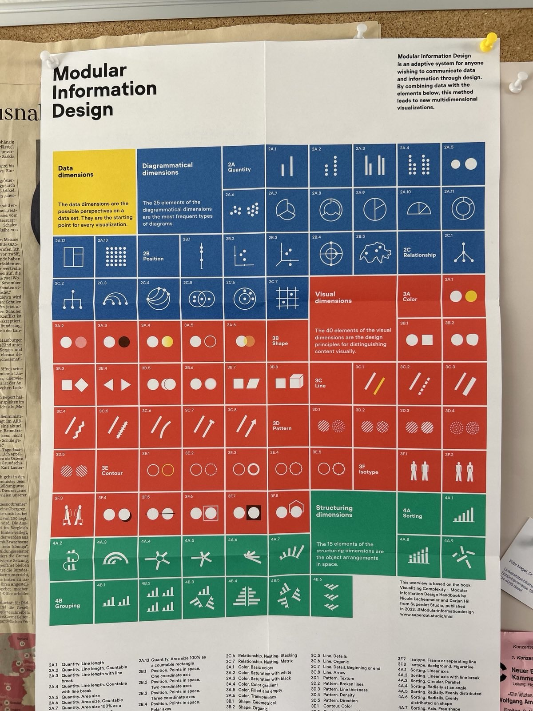

```{r setup, include=FALSE}
knitr::opts_chunk$set(echo = FALSE)

# Learn more about creating websites with Distill at:
# https://rstudio.github.io/distill/website.html

# Learn more about publishing to GitHub Pages at:
# https://rstudio.github.io/distill/publish_website.html#github-pages

```



# Session information

Sessions take place Thursdays, 8.15-9.45, Biozentrum, Hörsaal U1.131. 

::: l-body
| # | Date     | Topic                         | Instructor(s) | Slides | Exercise |
|---| ---------|-------------------------------|--------| --------| --------|
| 1 | 19.09.2024 | What is science communication? | Mata | [pdf](presentations/SCICOM_session1.pdf)| |
| 2 | 03.10.2024 | Models and elements of science communication | Mata | [pdf]()| |
| 3 | 10.10.2024 | Scientific uncertainty and trust in science | Mata | [pdf]()| |
| 4 | 17.10.2024 | Guidelines for science communication | Mata | [pdf]()| |
| 5 | 24.10.2024 | Science communication gone wrong | Mata | [pdf]()| A |
| 6 | 31.10.2024 | Practical: Knowledge and Data Visualization | Hil/Lachenmeier | [pdf]()| B |
| 7 | 07.11.2024 | Practical: Modular Information Design | Hil/Lachenmeier | [pdf]()| C |
| 8 | 14.11.2024 | Practical: Modular Information Design | Hil/Lachenmeier | [pdf]()| D |
| 9 | 21.11.2024 | Practical: Modular Information Design | Hil/Lachenmeier | [pdf]()| E |
|10 | 28.11.2024 | Practical: Modular Information Design | Hil/Lachenmeier | [pdf]()| F |
|11 | 05.12.2024 | Practical: Modular Information Design | Hil/Lachenmeier | [pdf]()| G |
|12 | 12.12.2024 | Practical: Modular Information Design | Hil/Lachenmeier | [pdf]()| H |
|13 | 19.12.2024 | [Exam](exam.html) | |
:::

# Course description and learning goals

This course aims to give a broad introduction to science communication. By completing the course you can expect to... 

- Get an overview of theories and principles of science communication
- Learn to develop visual communication strategies for science communication
- Learn to critically evaluate and reflect on science communication

This website is designed to help course participants get an overview of the course and the course slides (slides will be uploaded shortly after each session). Additionally, an [FAQ](https://adam.unibas.ch/goto_adam_crs_1787425.html) forum is available on ADAM.  

# Course grading

The final grade for the course will be based on two components:

**Exam (40%)**

At the end of the semester, a multiple-choice exam will test your understanding of core concepts covered in lectures and readings. You can find information about the location and time of the exam in the [course directory](https://vorlesungsverzeichnis.unibas.ch/de/home?id=287275).

**Exercises (60%)**

Practical exercises will make up the majority of your grade. These exercises will apply the principles learned in class to hands-on tasks. Both the timely submission and the quality of your work will be critical in determining your grade. Exercises should be submitted via [ADAM](https://adam.unibas.ch/goto_adam_crs_1787425.html)

*Exercise A (11%)*

This exercise involves a brief reflection task. You will be asked to critically assess an example of science communication of your choice (e.g., a news article, blog post, video, podcast, etc.) based on what you learned in the course. Your reflection, which should not exceed 300 words, should address the following:
What is the main message of the communication?
Who is the target audience?
What are the strengths and weaknesses?
How could it be improved?
Submit your reflection (including a link to the example of your choice) as a PDF file.

*Exercises B-H (7 exercises, 7% each)*

During each session, you will complete a task involving manual drawing (materials will be provided), followed by a brief homework assignment. The goal is to develop an understanding of visualization principles through active creation and to learn how to critically evaluate visualizations. "Drawing by hand is thinking" is an approach that combines creative and analytical thinking: By drawing manually, we aim to foster a deep understanding that is independent of digital tools and applicable in studies, research, and practice. For each session, you will have 12 hours to upload the in-class task (in case you have to miss the session and cannot do it in class) and 6 days to submit the homework assignment.


# Recommended readings

- ["50 Essentials on Science Communication"](https://www.degruyter.com/document/doi/10.1515/9783110763577/html) edited by  Jean Paul Bertemes, Serge Haan, and Dirk Hans.

- ["Visualizing Complexity: Modular Information Design Handbook"](https://www.degruyter.com/document/doi/10.1515/9783035625066/html) by Darjan Hill and Nicole Lachenmeier.  
